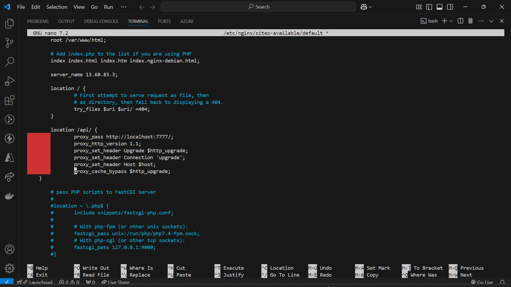

- Backend code (Deploying)

    - Allowed ec2 instance public IP on mongo db server
    - npm install pm2 -g
    - npm start
    - pm2 start npm -- start
    - 
    - 
    - pm2 logs 
    - pm2 logs, pm2 flush <name>, pm2 delete <name>, pm2 stop 
    <name>, pm2 list
    - pm2 start npm --name "devSwipe-backend"  -- start [rename from npm to devSwipe-backend]
    - nginx config: sudo nano /etc/nginx/sites-available/default

    - config:
        - server_name 13.60.83.3;
        
        - location /api/ {
        proxy_pass http://localhost:7777/;
        proxy_http_version 1.1;
        proxy_set_header Upgrade $http_upgrade;
        proxy_set_header Connection 'upgrade';
        proxy_set_header Host $host;
        proxy_cache_bypass $http_upgrade;
    }

    - 
    - restart nginx : sudo systemctl start nginx

    - Frontend: http://13.60.83.3/
    - backend: http://13.60.83.3:7777/
    - domain name: devswipe.com => 13.60.83.3