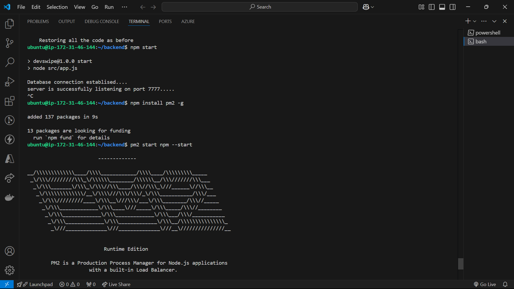
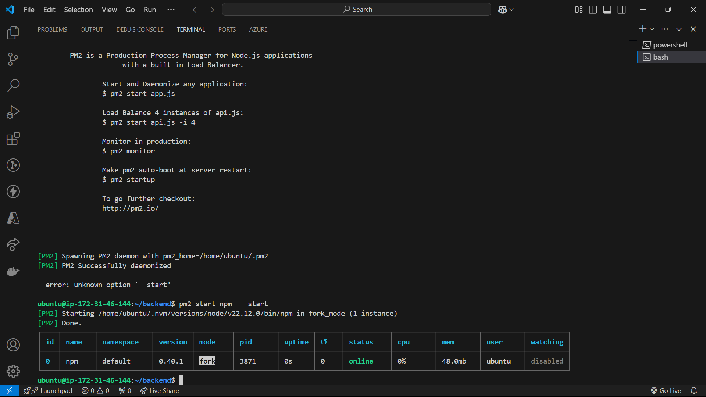
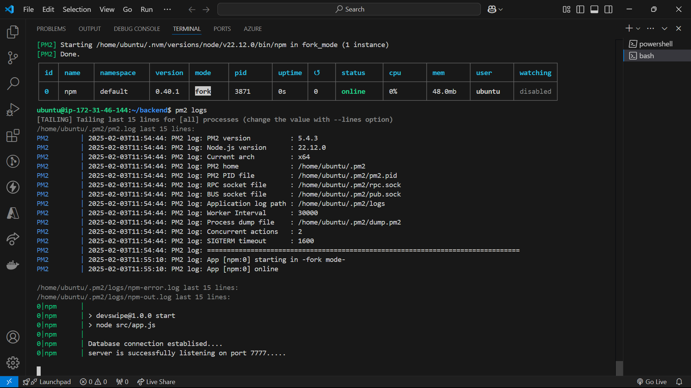

- Backend code (Deploying)
    - Allowed ec2 instance public IP on mongo db server
    - npm install pm2 -g
    - npm start
    - pm2 start npm -- start
    - 
    - 
    - pm2 logs 
    - pm2 logs, pm2 flush <name>, pm2 delete <name>, pm2 stop <name>, pm2 list
    - pm2 start npm --name "devSwipe-backend"  -- start [rename from npm to devSwipe-backend]

