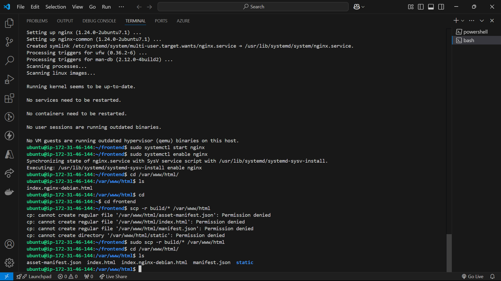
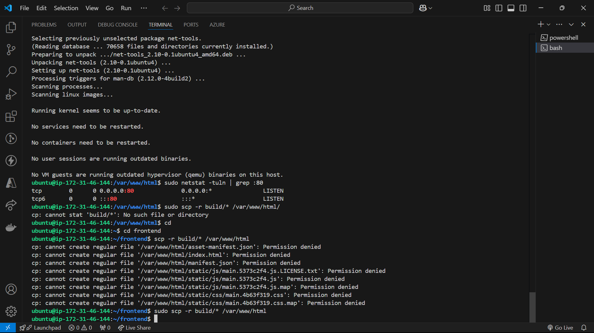
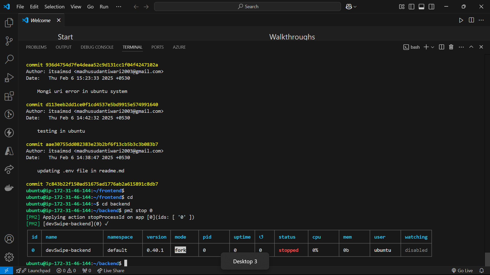
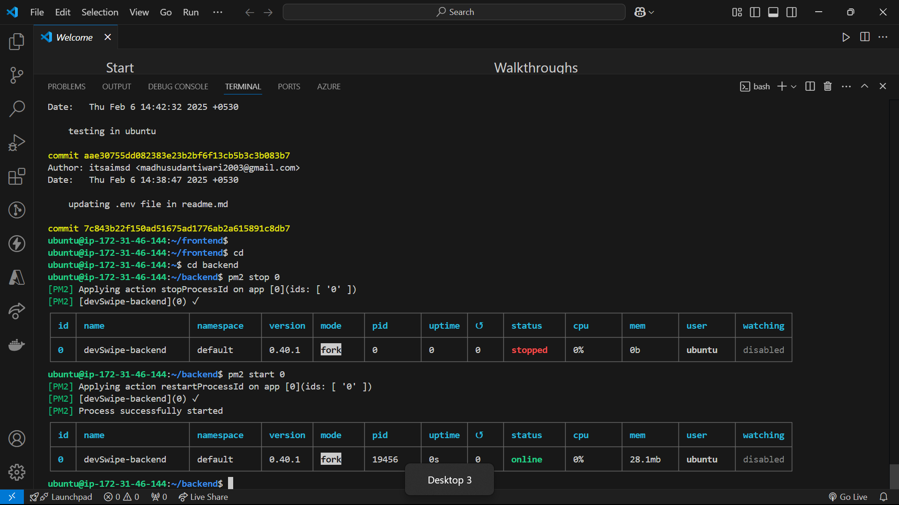

# DevSwipe UI

- Create a Vite + React application
- Remove uneccesary code and create a Hellow world app
- Install Tailwind CSS
- Install Daisy UI
- Add NavBar component to App.jsx
- Create a NavBar separate Component file
- Install react router dom
- Create BrowserRouter > Routes>Route=/ Body >RouteChildren
- Create an Outlet in your Body Component
- Create a Footer
- Create a login page
- Install axios
- CORS -Install cors in backend =>add middleware to with configuration: origin,credentials:true
- Whenever you're making API call so passed axios => {withCredentials:true}
- install react-redux + @reduxjs/toolkit - https://redux-toolkit.js.org/introduction/getting-started
- configureStore => Provider => createSlice => add reducer to store
- Add redux devtools in chrome
- Login and see if your data is coming properly in the store
- NavBar should update as soon as user as logs in
- Refactor our code to add constants file + create a components folder
- you should not be access other routes without login
- If token is not present,redirect user to login page
- Logout feature
- Get the feed and the feed in the store
- build the user card on feed
- Show toast message on save profile
- New Page -see all my connections
- Feature - Accept/Reject Connection Request
- send/ignore the user card from Feed
- send/ignore the user card from Feed
- Signup New User
- E2ETesting

- Body
  NavBar
  Route=/ =>Feed
  Route=/login =>login
  Route=/connections =>Connections
  Route=/profile =>Profile

# deployement
- Signup on aws 
- create a new account
- create a key value pair
- Launch instance
- chmod 400 "dev-swipe-secret.pem"
- ssh -i "dev-swipe-secret.pem" ubuntu@ec2-13-60-83-3.eu-north-1.compute.amazonaws.com
- Install the correct version of node v22.12.0
- git clone both frontend/backend
  - frontend
    - npm install ->dependencies install
    - npm run build
    - sudo apt update
    - sudo apt install nginx
    - sudo systemctl start nginx
    - sudo systemctl enable nginx
    - 
    - copy code from build(build files) to /var/www/html/
    - sudo scp -r build/* /var/www/html/ (ubuntu@ip-172-31-46-144:~/frontend$ sudo scp -r build/* /var/www/html)
    - Enabel port 80 of your instance
    - 

# Adding a custom Domain name
  - purchased domain name from godaddy
  - sign up on cloudflare & add a new domain name
  - change the namseserver on godaddy and point it to cloudflare
  - wait for sometimes till your nameservers are updated ~15min
  - DNS record: A devswipe.in 13.60.83.3
  - Enable SSL for website

# Sending Emails via SES
  - Create a IAM user
  - Give access to AmazonSESFullAccess
  - Amazon SES:Create an Identity
  - Verify your domain name
  - Verify an Email identity
  - Install AWS SDK -v3 [https://github.com/awsdocs/aws-doc-sdk-examples/tree/main/javascriptv3/example_code/ses#code-examples]
  - setup SesClient
  - Access Credentials should be created in IAM under SecurityCredentials Tab
  - Add the credentials to the env file
  - Write code for SESClient
  - Write the code Sending email address
  - Make the email dynamics by passing more params to the run function
  - add .env file
 
# Process to deploy when u make any changes 
- frontend
  - cd frontend
  - npm run build
  - sudo scp -r build/* /var/www/html
  - done
- backend
  - pm2 stop 0 []
  - pm2 start 0 []
  - pm2 start npm --name "devSwipe-backend" -- start

# Schduling cron jobs in NodeJs
  - Installing node-cron
  - Learning about cron expressions syntax - crontab.guru
  - Schdule a job
  - date-fns
  - Find all the unique id who have got connection friend in previous day
  - send email
  - Explore queue mechanism to send bulk emails or check amazon ses bulk emails